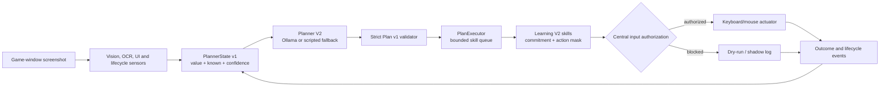

# MMO LLM planner architecture

## Runtime data flow

The screenshot is not sent directly to the planner trainer. The owned loop
extracts structured observations from capture, OCR, UI memory, life state, and
other sensors. `build_planner_state` preserves unknown readings separately from
known `false` or zero values. Saved frames support review, but visual
representation learning is deferred.

Planner V2 produces a bounded high-level plan, not raw keys. A valid plan has a
goal, one to five skill steps by default, time limits, replan events,
confidence, a reason code, and a summary. The validator rejects malformed JSON,
invented or unavailable skills, invalid timeouts/events, and plans that mix
death recovery with combat. Invalid, low-confidence, unavailable, or timed-out
LLM output falls back to a validated scripted plan.

Learning V2 owns low-level skill execution, commitment/hysteresis, action
masking, and lifecycle-aware recovery. Planner V2 only queues validated skill
names. Planning occurs on meaningful events or a periodic interval, not on
every frame.

## Operating modes

| Mode | Planner behavior | Can send input? |
|---|---|---|
| `observe` | No Planner V2 calls | Never |
| `shadow` | Generate, validate, and log plans | Never |
| `assist` | Await explicit plan approval | Only with approval and both ownership flags |
| `hybrid` | Planner skills feed Learning V2 | Only with both ownership flags |
| `autonomous` | Planner may dispatch validated skills | Only with both ownership flags |
| `replay` | Offline/review intent | Never |

The required authorization flags are `i_own_this_game=true` and
`enable_keyboard=true`. The GUI's **live keyboard** option controls whether the
owned loop uses the real actuator. All layers must agree before input is sent.

These planner modes are distinct from Learning V2 policy modes (`scripted`,
`hybrid`, `legacy_q`, and `behavior_clone`), which select the high-level skill
policy beneath the planner.

## Safety boundaries

- Safe configuration defaults are `mode=shadow`, ownership false, and keyboard
  disabled.
- The strict skill allowlist and action mask prevent arbitrary model text from
  becoming keys.
- Plan length is bounded; skill durations default to 1–120 seconds.
- Death, ghost, critical health, severe stuck, modal, target-invalid, skill
  failure, progress, expiry, and recovery events trigger replanning.
- A low-confidence or invalid LLM plan is replaced by a scripted fallback.
- Focus loss reported by capture causes a soft emergency stop and `wait`.
- The GUI emergency stop blocks planner execution and clears its queue.
- Assist approval is per current plan; rejection clears the plan.
- Training and evaluation register candidates but never promote automatically.
- No injection, anti-cheat bypass, stealth, or terms-of-service evasion is
  implemented or in scope.

## Implementation status

The structured state/plan contracts, validator, runtime modes, Ollama client,
skill handoff, source-separated demonstrations, model registry, GUI surfaces,
and offline benchmark are implemented and automated-test covered. Synthetic
smoke runs and frozen scenarios test plumbing only. Real model quality, visual
learning, and live gameplay improvement remain unproven until the user records
real demonstrations and performs held-out and controlled live evaluation.
